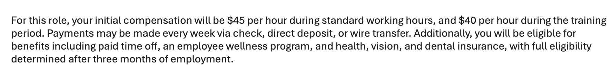
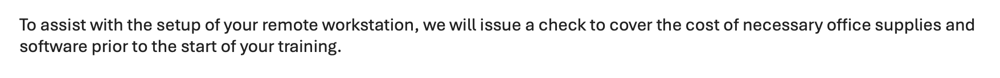
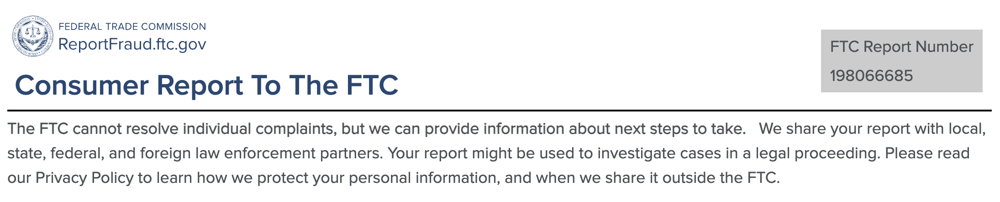

# Incident Report: Phishing & Employment Fraud Analysis

**Author:** Jonathan Canales  
**Date:** February 20, 2026  
**Category:** Phishing / Identity Theft Attempt  
**Status:** MITIGATED & REPORTED

## 1. Executive Summary
This report details an attempted phishing attack targeting a job seeker. The attacker utilized impersonation, social engineering, and the promise of high compensation to initiate a "Fake Check" scam. The threat was mitigated through cross-referencing professional networks and identifying technical red flags.

## 2. Evidence & Analysis

### A. Impersonation of Executive Leadership
The attacker used the name of the company's Founder to establish false authority. 
* **Finding:** Cross-referencing LinkedIn confirmed the real individual's role. 
* **Analysis:** Founders typically do not manage entry-level recruitment, indicating a high-level impersonation attempt.

### B. Technical Red Flags (Email Analysis)
* **Email Address:** `hrcareersgethelpt@gmail.com`
* **Analysis:** The lack of a corporate SPF/DKIM verified domain is a 100% indicator of fraud in this context.

### C. Financial Tactics (The Fake Check)
The email requested to send a check for "workstation setup" prior to training.
* **Analysis:** This is a classic Advance Fee scam designed to leave the victim liable for bounced check funds after sending money to a "vendor."

## 3. Incident Response Actions
1. **Victim Notification:** Sent a message to the real Matthew Pincus on LinkedIn to report the identity theft.
2. **Federal Reporting:** Filed official reports with the **FTC** and **FBI IC3**.
3. **Platform Reporting:** Reported the sender to Google's Phishing team to shut down the `gmail.com` account.

## 4. Evidence Gallery
* *Federal Trade Commission (FTC) Report Confirmation*
* *FBI IC3 Submission Confirmation*
* *Original Phishing Email Screenshots*

*(Note: Actual screenshots are located in the /evidence/ folder of this repository.)*
